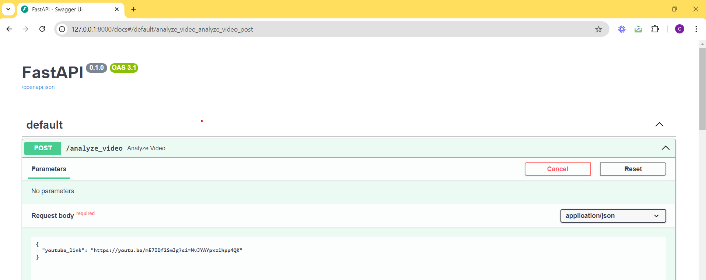

# Gemini Dynamo

## Overview
The Gemini Dynamo project integrates both frontend and backend technologies to efficiently analyze and structure comprehensive transcripts from YouTube videos. This initiative represents a significant transformation in study methods, enhancing digital learning experiences.

## Project Scenario
The project undertakes the complex challenge of analyzing lengthy YouTube transcripts through its Semantic Extraction Algorithm (SEA). Aimed at simplifying the study process for both students and educators, it efficiently identifies and categorizes key concepts and terms found in university lectures and other extensive video materials. DynamoCards revolutionizes digital learning by making it easier to create effective study routines and enhancing classroom instruction. By enabling users to distill hours of lecture content into concise and easily comprehensible summaries, this technology represents a major advancement in educational tools.

## Demo Video
https://github.com/user-attachments/assets/c1ba5f7d-3336-40d7-b8f8-d23e5a00ca63

## Features

- **Semantic Extraction Algorithm (SEA):** Efficiently processes extensive YouTube transcripts, identifying and structuring essential concepts.
- **Enhanced Learning Experience:** Simplifies the creation of effective study routines and improves classroom teaching by transforming hours of lecture content into clear, concise insights.
- **Intuitive User Interface:** The React-based frontend enables users to input a YouTube URL and receive organized keyword flashcards as the output.
- **Sophisticated Backend Processing:** Leverages the YouTube API, Google Cloud Platform's Vertex AI Gemini model, and custom processing techniques to manage and analyze video transcripts.


## Pre-requisites

- Python 3.8+
- Node.js 14+
- npm 
- FastAPI
  
## Project Structure
- Provides a clear overview of the project components
  ```sh
  root/
    │
    ├── backend/                 # Contains the FastAPI application
    │     ├── services/
                ├── main.py              
    │         ├── genai.py             # Core processing scripts for video analysis
    │         └── requirements.txt     # Project Dependencies
    │
    └── frontend/dynamocards               # Houses the React application
              ├── src/                 # Source files for the frontend
              ├── public/              # Public assets and HTML template
              ├── package.json         # NPM dependencies and scripts
              └── README.md            # Frontend documentation

## System Overview

1. **Frontend**:

   - Developed using React.
   - Accepts a YouTube URL as input and forwards the request to the backend.

2. **Backend**:

   - Handles the incoming request and utilizes the `YoutubeProcessor` object to retrieve the video transcript via the YouTube API.
   - Converts the video transcript into documents.
   - Divides the documents into a specified number of groups.
   - Each document group is processed by the `Geminiprocessor` object using the Google Cloud Platform's Vertex AI Gemini model, including performing a cost analysis.
   - Compiles the results from the different groups into a JSON object, which is then aggregated into a list.
   - Returns the list of JSON objects to the frontend.

   - Receives the request and uses the `YoutubeProcessor` object to fetch the transcript using the YouTube API.
   - Generates documents from the video transcript.
   - Processes the documents into a custom amount of groups.
   - Each group of documents is processed by the `Geminiprocessor` object using the GCP Vertex AI Gemini model, including a cost analysis.
   - Formats the results from different groups into a JSON object and stacks them into a list.
   - Sends the JSON object list back to the frontend.

3. **Output**:
   - The frontend presents the processed data as keyword flashcards.

## Setting Up

### Backend

1. Navigate to the backend directory
   ```sh
   cd backend
2. Set up a python virtual environment
   ```sh
   python -m venv env
3. Activate the virtual environemnt
   ```sh
   source venv/bin/activate 
4. Install the dependencies
   ```sh
   pip install -r requirements.txt
5. Run the FastAPI Server
   ```sh
   uvicorn main:app --reload

### Frontend

1. Navigate to the frontend directory
   ```sh
   cd frontend/dynamocards
   
2. Install Node Dependencies
   ```sh
   npm install
3. Start the react development environment
   ```sh
   npm run dev

## Workflow

- Backend:
  
  
  
  
- Frontend:
  

  
